# El Diario Tecsup — Portal de Noticias con Django

Laboratorio 6 de Django: portal de noticias con modelos relacionados, herencia de plantillas,
fragmentos reutilizables, archivos estáticos y de medios, panel de administración personalizado
y verificación del escapado automático de HTML.

**Autor:** Luis Cucho — Tecsup

## Tecnologías

| Herramienta | Versión |
|-------------|---------|
| Python      | 3.14    |
| Django      | 6.1.2   |
| Pillow      | 12.3.0  |
| Base de datos | SQLite |

## Instalación

```bash
git clone https://github.com/luiscucho-oss/django-news-portal.git
cd django-news-portal

python -m venv .venv
# Windows
.venv\Scripts\activate
# Linux / macOS
source .venv/bin/activate

pip install -r requirements.txt
python manage.py migrate
python manage.py createsuperuser
python manage.py seed_news      # 3 categorías, 3 autores y 5 noticias con imagen
python manage.py runserver
```

- Sitio: <http://127.0.0.1:8000/>
- Administración: <http://127.0.0.1:8000/admin/>

La sexta noticia («Feria del Libro de Lima rompe récord de visitantes») se registra
manualmente desde el administrador; es la que contiene la prueba de escapado.

## Estructura del proyecto

```
django-news-portal/
├── portal/                  # Proyecto (settings.py, urls.py)
├── news/                    # Aplicación
│   ├── models.py            # Category, Author, Article
│   ├── views.py             # home, article_detail, category_list
│   ├── urls.py              # Rutas con nombre (app_name = 'news')
│   ├── admin.py             # list_display, list_filter, search_fields
│   ├── context_processors.py
│   ├── tests.py             # Casos de prueba
│   └── management/commands/seed_news.py
├── templates/
│   ├── base.html            # Bloques: title, content, sidebar
│   └── news/
│       ├── _article_card.html   # Fragmento reutilizable
│       ├── home.html
│       ├── article_detail.html
│       └── category_list.html
├── static/css/styles.css
├── media/                   # Imágenes subidas (no se versiona)
└── docs/capturas/           # Capturas de pantalla
```

## Desarrollo del laboratorio

### 1. Configuración (`portal/settings.py` y `portal/urls.py`)

```python
INSTALLED_APPS = [..., 'news']

TEMPLATES = [{ 'DIRS': [BASE_DIR / 'templates'], ... }]

STATIC_URL = 'static/'
STATICFILES_DIRS = [BASE_DIR / 'static']

MEDIA_URL = 'media/'
MEDIA_ROOT = BASE_DIR / 'media'
```

```python
# portal/urls.py
urlpatterns = [
    path('admin/', admin.site.urls),
    path('', include('news.urls')),
]

if settings.DEBUG:
    urlpatterns += static(settings.MEDIA_URL, document_root=settings.MEDIA_ROOT)
```

### 2. Modelos

| Modelo     | Campos principales | Relaciones |
|------------|--------------------|------------|
| `Category` | `name`, `slug`, `description` | — |
| `Author`   | `name`, `email`, `bio` | — |
| `Article`  | `title`, `slug`, `summary`, `body`, `image` (ImageField), `published_at` | `author` → ForeignKey a `Author`; `categories` → ManyToMany a `Category` |

### 3. Plantillas

- **`base.html`** define la estructura del portal y los bloques ``,
  `` y ``.
- **`_article_card.html`** es la tarjeta de noticia; se incluye con
  `` en la portada y en el listado por categoría.
- **Portada:** recorre las noticias con ``, muestra un mensaje con `` y usa los filtros
  `|date:"d \d\e F \d\e Y"` y `|truncatewords:25`.
- **Detalle:** hereda de `base.html` y muestra imagen, autor, fecha, categorías y noticias relacionadas.
- **Categoría:** filtra las noticias por slug y reutiliza la tarjeta.

### 4. URLs con nombre

```python
app_name = 'news'

urlpatterns = [
    path('', views.home, name='home'),
    path('noticia/<slug:slug>/', views.article_detail, name='article_detail'),
    path('categoria/<slug:slug>/', views.category_list, name='category'),
]
```

En las plantillas todos los enlaces usan ``,
`` y ``;
no hay direcciones escritas a mano.

### 5. Administración

| Modelo   | `list_display` | `list_filter` | `search_fields` |
|----------|----------------|---------------|-----------------|
| Noticia  | título, autor, categorías, fecha | categorías, autor, fecha | título, resumen, cuerpo, autor |
| Categoría| nombre, slug, n.º de noticias | fecha de las noticias | nombre, descripción |
| Autor    | nombre, correo, n.º de noticias | categorías de sus noticias | nombre, correo, biografía |

## Capturas de pantalla

### Sitio público

**Portada** — seis noticias en tres categorías, con fecha formateada y resumen recortado.

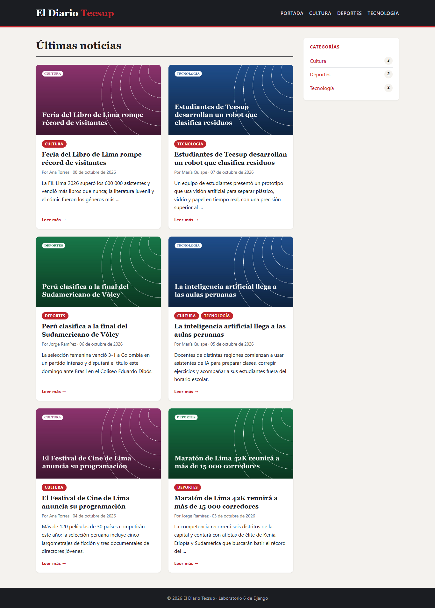

**Detalle de una noticia** — imagen destacada, autor, fecha y categorías enlazadas.

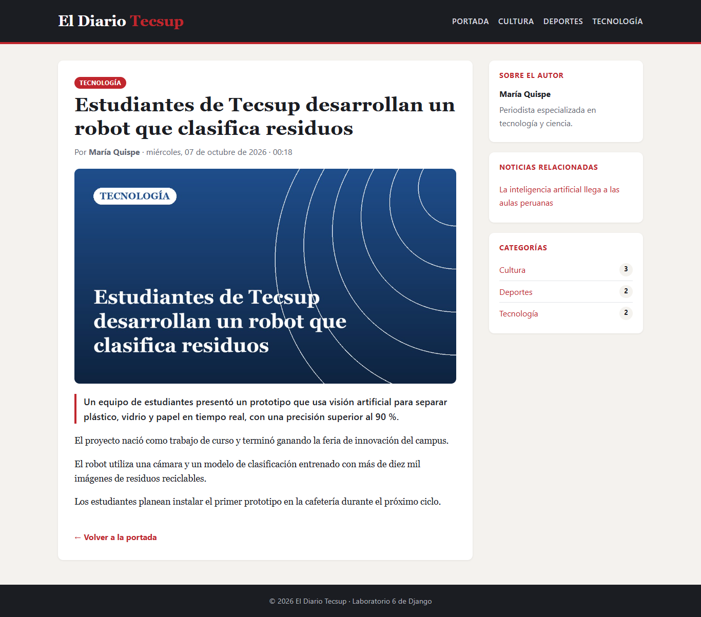

**Listado por categoría (Cultura)** — reutiliza el fragmento `_article_card.html`.

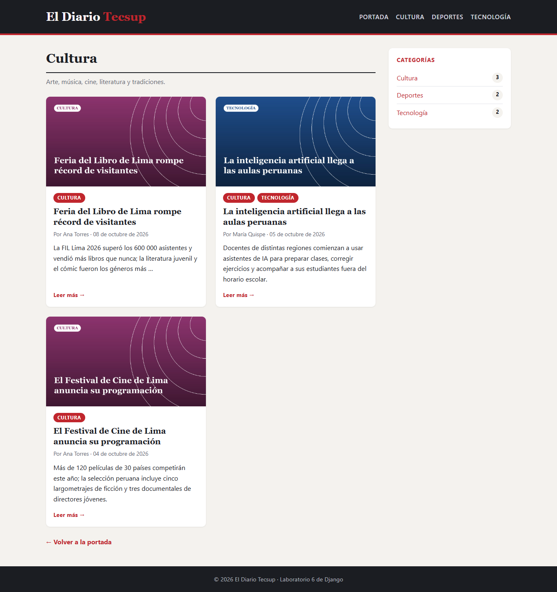

**Estado vacío** — `` cuando una categoría no tiene noticias.

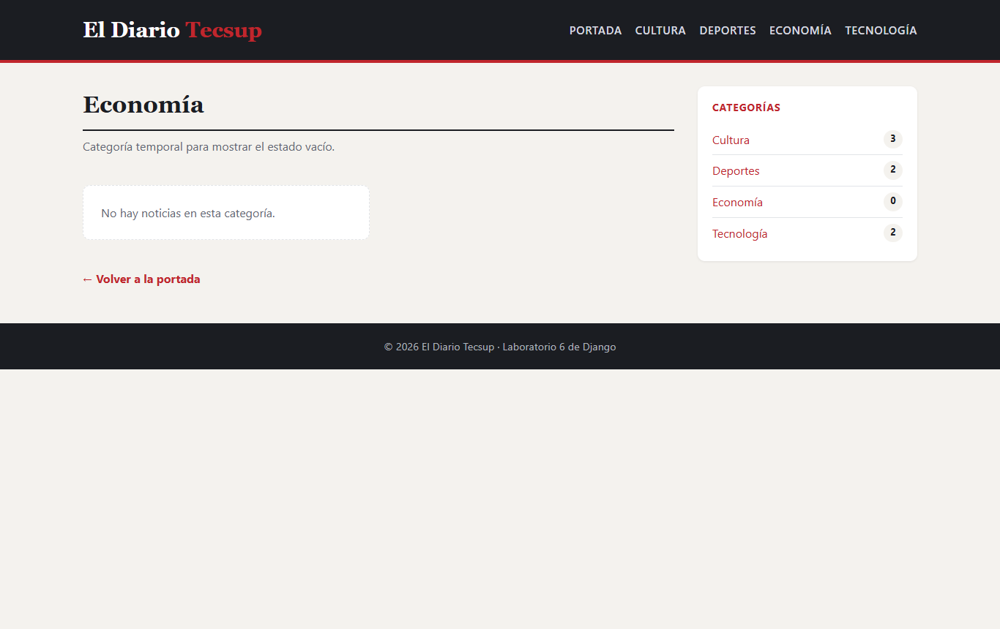

**Vista móvil**

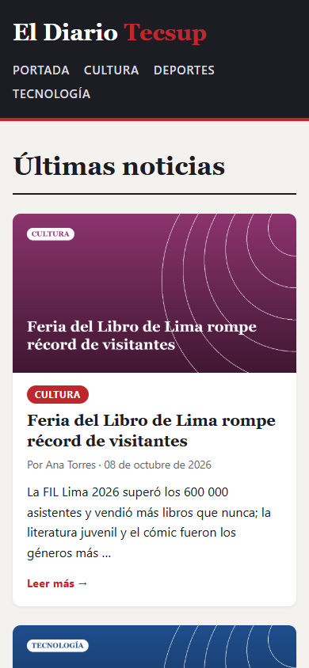

### Panel de administración

**Inicio de sesión del superusuario**

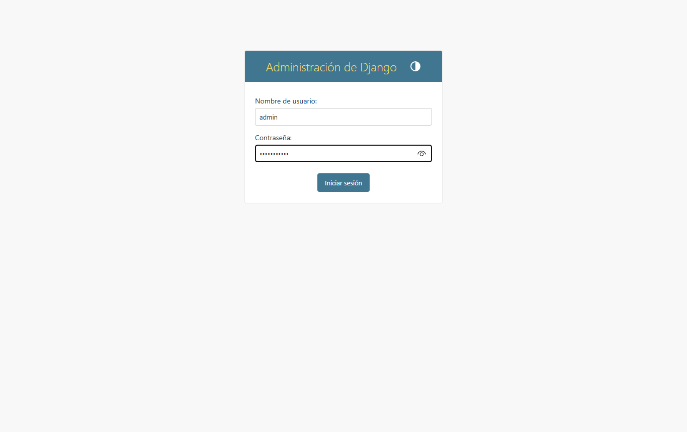

**Inicio del administrador**

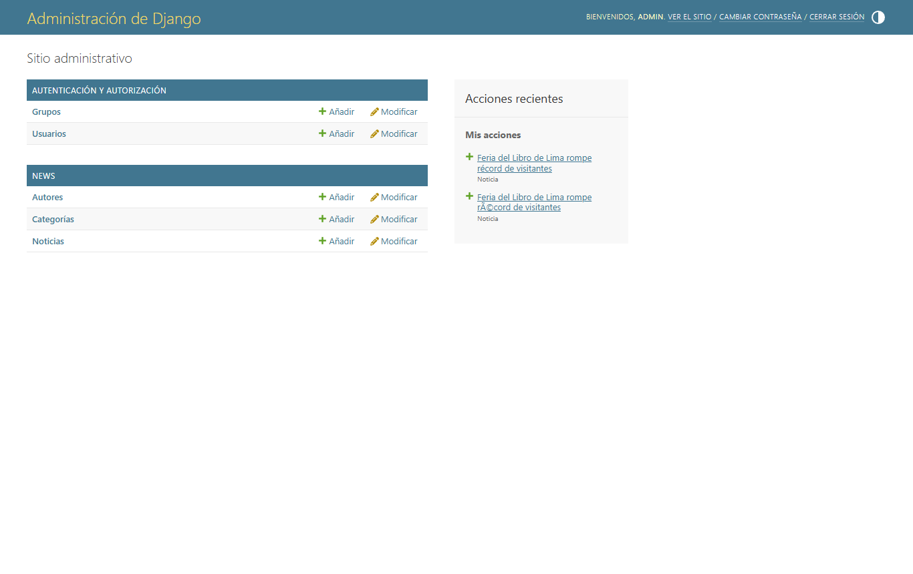

**Registro de una noticia desde el administrador**

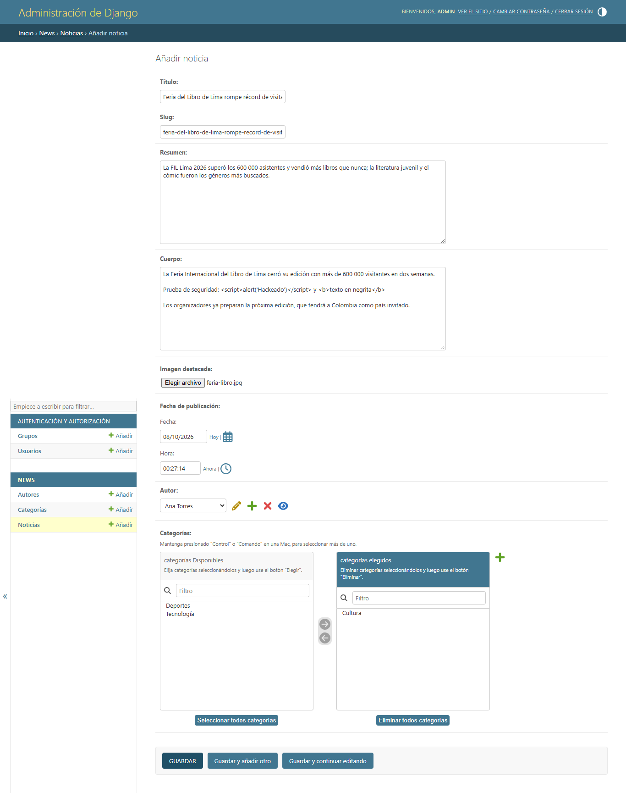

**Listado de noticias** (`list_display`, `list_filter`, `date_hierarchy`)

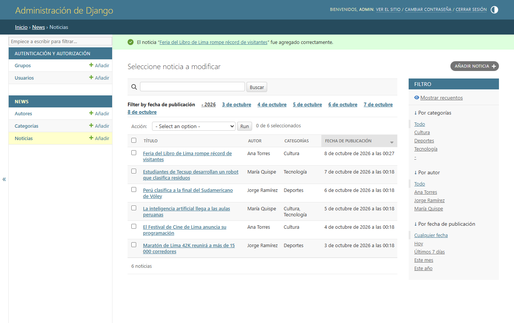

**Búsqueda** (`search_fields`: «vóley»)

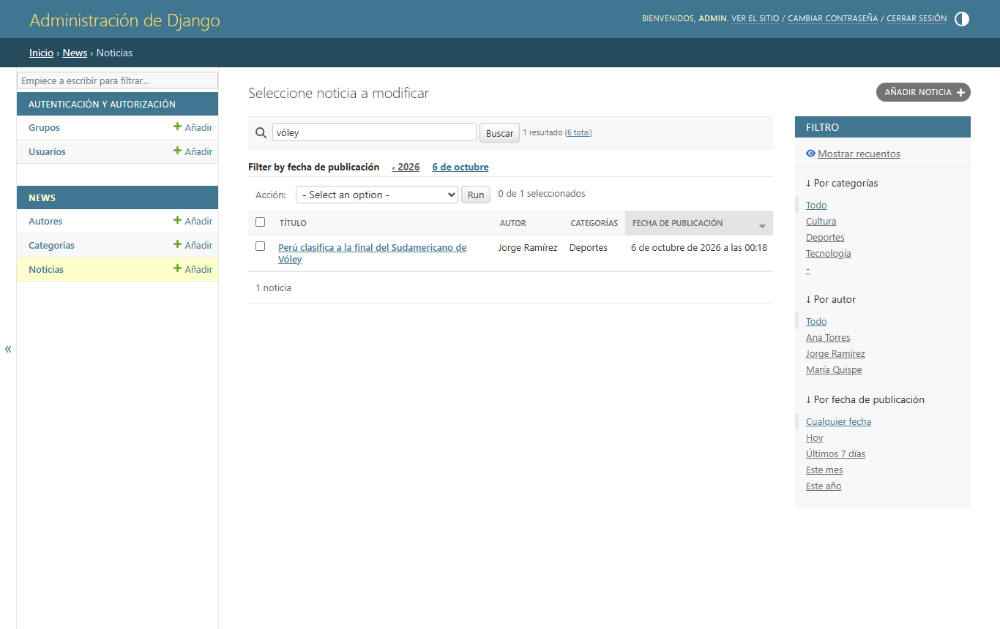

**Filtro por categoría** (`list_filter`: Cultura)

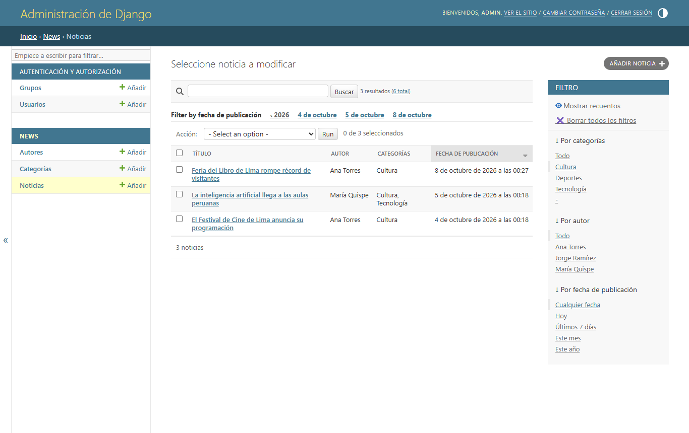

**Categorías y autores**

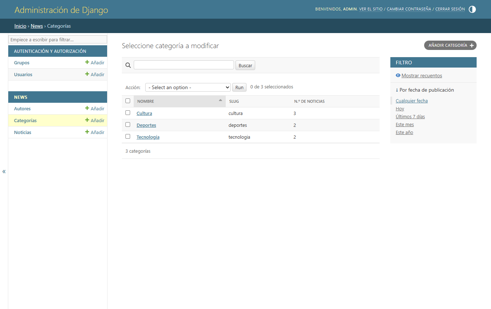

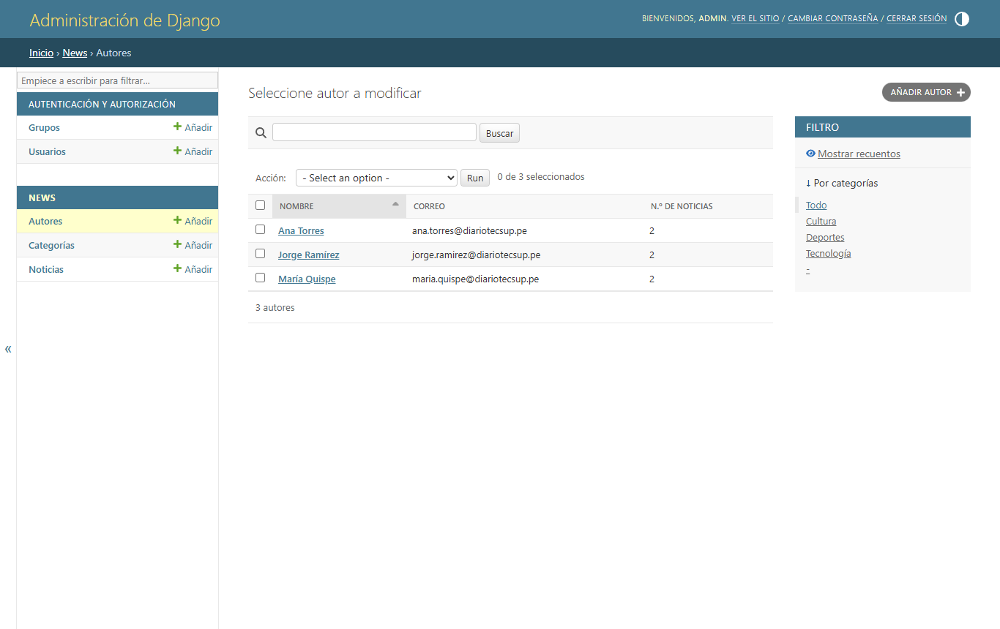

## Prueba de escapado automático

En el cuerpo de la noticia «Feria del Libro de Lima rompe récord de visitantes» se escribió desde el
administrador:

```html
Prueba de seguridad: <script>alert('Hackeado')</script> y <b>texto en negrita</b>
```

**Resultado en el navegador:** las etiquetas aparecen como texto. No se ejecuta ningún `alert`
y la palabra «texto en negrita» no se muestra en negrita.

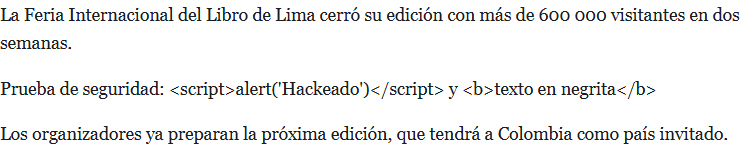

**HTML que envía el servidor:**

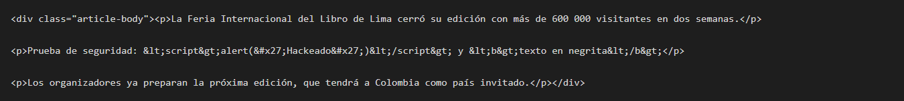

**¿Por qué?** Django activa el *autoescape* en todas las plantillas. Al imprimir
`{{ article.body }}`, convierte los caracteres especiales en entidades HTML:

| Carácter | Se convierte en |
|----------|-----------------|
| `<`      | `&lt;`          |
| `>`      | `&gt;`          |
| `'`      | `&#x27;`        |
| `"`      | `&quot;`        |
| `&`      | `&amp;`         |

Así, el navegador muestra el texto en vez de interpretarlo como código. Esto protege al sitio de
ataques **XSS (Cross-Site Scripting)**: aunque alguien con acceso al administrador, o un formulario
público, guarde un `<script>` malicioso, este nunca se ejecuta en el navegador de los lectores.

El escapado solo se desactiva de forma explícita, con el filtro `|safe` o el bloque
``, y solo debe hacerse con contenido 100 % confiable. El filtro `|linebreaks`
usado en el detalle respeta el escapado: primero escapa el texto y luego añade las etiquetas `<p>`.

## Casos de prueba

Se ejecutan con:

```bash
python manage.py test news
```

| # | Caso de prueba | Resultado esperado | Estado |
|---|----------------|--------------------|--------|
| 1 | Abrir la portada | 200, usa `base.html` y `_article_card.html`, lista las noticias | ✅ |
| 2 | Portada sin noticias | Muestra «No hay noticias publicadas todavía.» (``) | ✅ |
| 3 | Resumen de más de 25 palabras | Se recorta con `truncatewords:25` | ✅ |
| 4 | Abrir el detalle de una noticia | Muestra autor, categorías enlazadas e imagen | ✅ |
| 5 | Abrir una noticia que no existe | Responde 404 | ✅ |
| 6 | Listado por categoría | Solo muestra noticias de esa categoría y reutiliza la tarjeta | ✅ |
| 7 | Categoría sin noticias | Muestra «No hay noticias en esta categoría.» | ✅ |
| 8 | HTML dentro del cuerpo | Se muestra escapado (`&lt;script&gt;`), no se ejecuta | ✅ |
| 9 | Hoja de estilos | La página enlaza `/static/css/styles.css` mediante `` | ✅ |

```
Ran 9 tests in 0.067s

OK
```

Además, se verificó manualmente con el servidor de desarrollo:

| URL | Código |
|-----|--------|
| `/` | 200 |
| `/noticia/festival-cine-lima-programacion/` | 200 |
| `/categoria/deportes/` | 200 |
| `/static/css/styles.css` | 200 |
| `/media/articles/festival-cine-lima-programacion.jpg` | 200 |
| `/noticia/no-existe/` | 404 |
